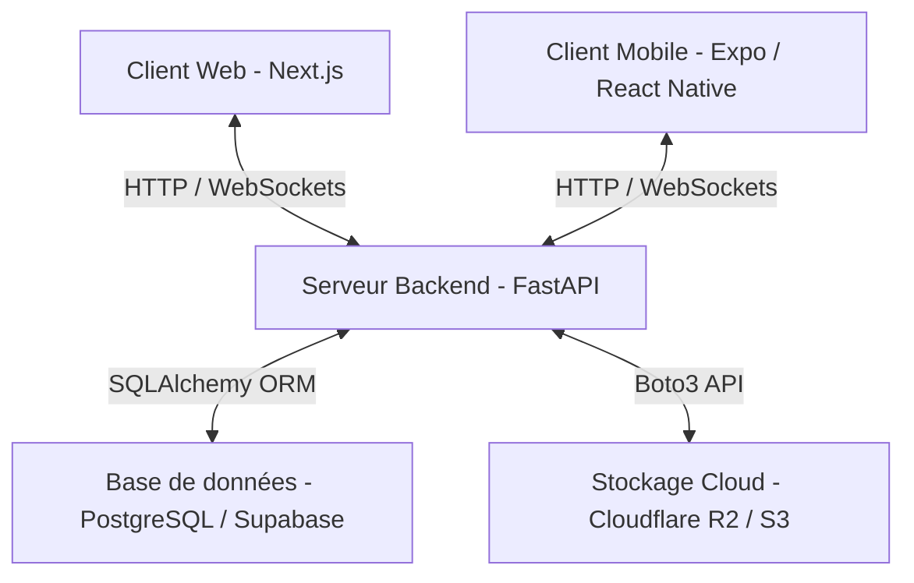
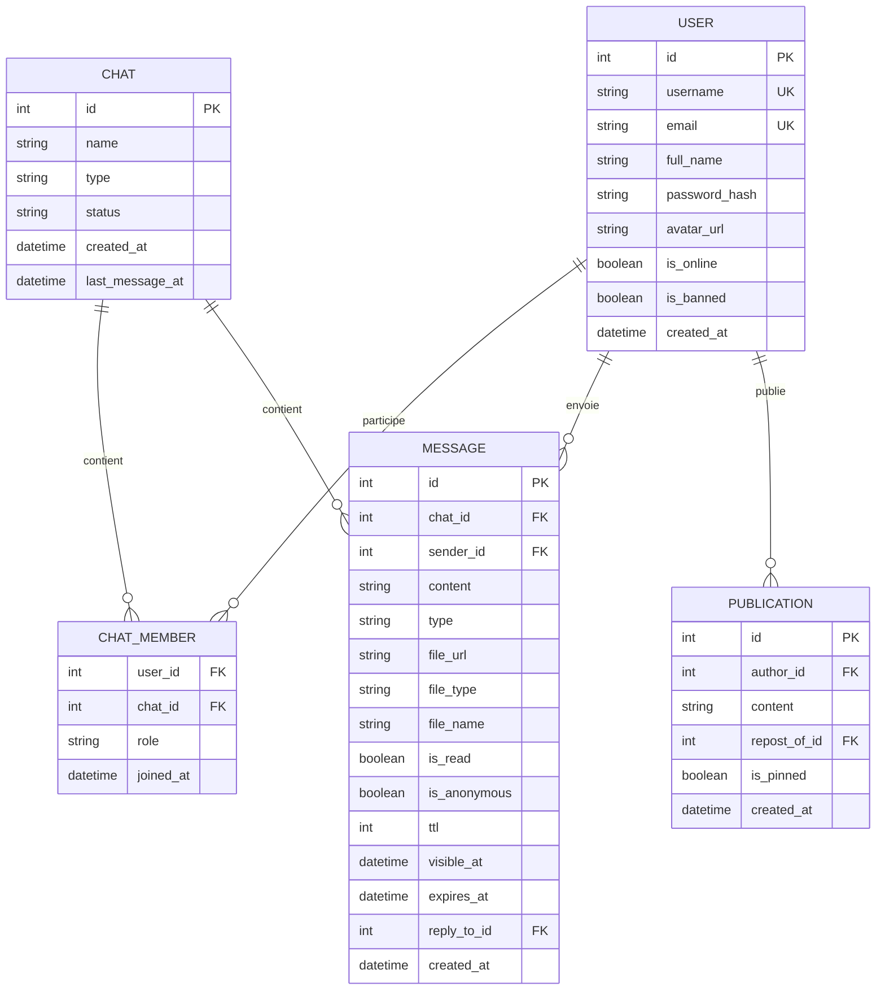
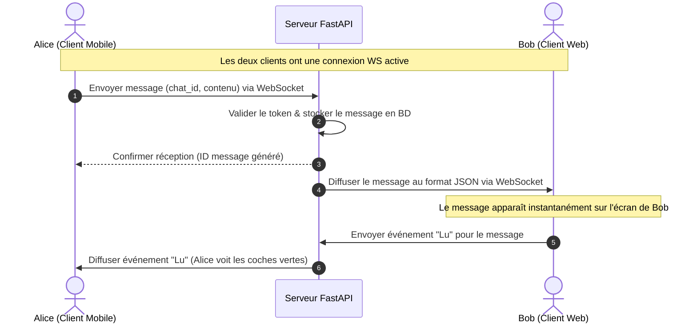
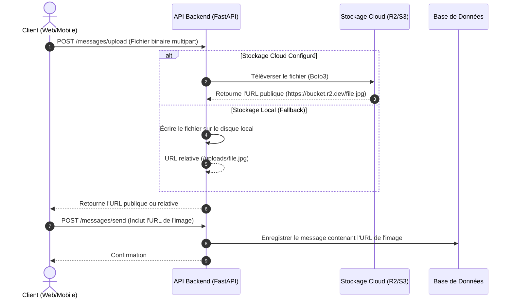

# Document 2 : Dossier de Conception & d'Implémentation - IQChat

## 1. Architecture Système Globale
IQChat repose sur une architecture moderne, découplée et *stateless* (sans état interne au niveau du serveur de calcul), ce qui permet des montées en charge économiques et un déploiement cloud fluide.

---

## 2. Technologies Clés & Rôle
1. **Backend (Python / FastAPI)** :
   * Fournit une API REST ultra-rapide pour l'authentification et l'administration.
   * Gère les connexions WebSocket bi-directionnelles pour la messagerie instantanée.
   * Totalement *stateless* : les fichiers temporaires ne sont pas conservés localement, garantissant la compatibilité avec les instances de calcul éphémères (Render, Railway).
2. **Frontend Web (React / Next.js / TypeScript)** :
   * Interface utilisateur responsive conçue en CSS personnalisé (sans frameworks lourds) pour un chargement instantané.
   * Utilise les hooks React pour synchroniser l'état local avec les flux de messages du WebSocket.
3. **Frontend Mobile (React Native / Expo)** :
   * Compile une application native unique pour Android et iOS.
   * Gère la saisie intelligente avec évitement du clavier (`KeyboardAvoidingView`) et intègre l'API `expo-haptics` pour les retours tactiles.
4. **Base de Données (PostgreSQL via Supabase)** :
   * Stocke de manière robuste les données relationnelles (utilisateurs, groupes, métadonnées des messages).
5. **Stockage Cloud (Cloudflare R2 / AWS S3)** :
   * Reçoit directement les flux de fichiers binaires des pièces jointes et des avatars via le backend pour éviter de surcharger la base de données.

---

## 3. Modèle de Données (Base de Données)

Le schéma ci-dessous montre la structure des tables SQL générées par SQLAlchemy :

---

## 4. Diagrammes de Flux Séquentiels

### 4.1. Envoi et Réception de Message en Temps Réel (WebSockets)

### 4.2. Téléversement de Pièce Jointe et envoi de message

---

## 5. État d'Implémentation & Optimisations Réalisées

Au cours des dernières sessions de développement, les optimisations de niveau production suivantes ont été finalisées :
1. **Migration et Support PostgreSQL** : Configuration dynamique de la connexion SQLAlchemy dans `database.py`. Elle prend en charge SQLite en local et PostgreSQL (Supabase) en production sans modification de code.
2. **Stateless Cloud Storage** : Intégration de `boto3` dans `storage.py` pour un téléversement direct sur Cloudflare R2 / S3. Les routes d'envoi de messages et de mise à jour d'avatar ont été modifiées pour exploiter ce service, évitant l'écriture sur disque local et le stockage base64 dans la BD.
3. **Réduction de charge de la Base de Données (-90% requêtes)** : Les boucles de rafraîchissement (polling) ont été ralenties intelligemment :
   * Liste de chats : de 3s à **15s**.
   * Informations de chat ouvert : de 3s à **30s**.
   * Flux de publications : de 3s à **20s**.
4. **Design Royal & Redesign de l'Authentification** : Redessin complet des formulaires Web et Mobile. Intégration du nouveau logo premium, boutons de type tab, masquage/affichage dynamique des mots de passe (icônes d'yeux), et gestion de l'évitement du clavier sur mobile.
5. **Améliorations d'Interaction Frontend** :
   * **Vibrations tactiles (Mobile)** : Utilisation d'onglets et de notifications d'action via `expo-haptics`.
   * **Skeletons animés** : Remplacement des écrans de chargement par des structures simulées scintillantes (Web et Mobile).
   * **Bandeau de Déconnexion** : Affichage d'un bandeau rouge dynamique lors de la perte du signal WebSocket.
