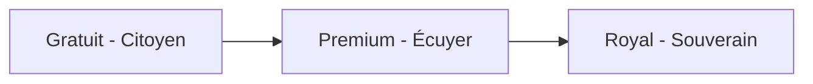

# Document 4 : Manuel d'Utilisation & Présentation Commerciale - IQChat

Bienvenue sur **IQChat**, la messagerie cognitive royale. Ce guide est conçu pour vous présenter les fonctionnalités uniques de l'application, vous accompagner lors de votre première connexion, et détailler la grille d'abonnements disponibles.

---

## 1. Concept & Philosophie d'IQChat
**IQChat** n'est pas une simple application de clavardage. C'est un espace conçu pour la **stimulation mentale, l'apprentissage continu et le développement personnel**. Au fil de vos discussions quotidiennes, vous exercez votre réflexion, partagez des connaissances et suivez l'évolution de vos compétences intellectuelles grâce à des mini-défis et à un accompagnement par intelligence artificielle.

Le tout est enveloppé dans une esthétique "Royale" et premium, alliant la clarté moderne à des touches dorées et bleutées prestigieuses.

---

## 2. Démarrage Rapide

### 2.1. Inscription et Connexion
*   **Créer votre compte** : Lancez l'application (sur le web ou sur votre smartphone). Accédez à l'onglet **Inscription**. Remplissez vos informations (nom, e-mail, identifiant et mot de passe). Pour l'avatar, vous pouvez modifier votre photo à tout moment depuis votre profil.
*   **Connexion** : Saisissez vos identifiants. Vous pouvez cliquer sur l'icône de l'**œil** pour dévoiler momentanément votre mot de passe et éviter les erreurs de saisie. Sur mobile, des vibrations douces vous indiquent si la connexion a réussi ou si vos identifiants sont erronés.

### 2.2. Initier une Discussion
1. Basculez sur l'onglet **Annuaire** (Directory).
2. Utilisez la barre de recherche pour trouver vos contacts en saisissant leur nom ou leur identifiant.
3. Cliquez sur le profil pour lui envoyer une demande de discussion. Dès que l'invitation est acceptée, la discussion apparaît dans votre onglet **Messages**.
4. Pour créer une discussion de groupe, saisissez le nom de votre groupe dans la zone **Nouveau Groupe (nom)** au-dessus de la liste de messages, puis cliquez sur **Groupe**.

---

## 3. Les Fonctionnalités Majeures d'IQChat

### 3.1. Les Modes de Messages Avancés
Lors de la saisie d'un message, vous pouvez choisir sa nature en utilisant les onglets situés juste au-dessus du champ de texte :
*   **Normal** : Un message standard.
*   **Caché (👀)** : Le message s'affiche de manière floutée. Le destinataire doit cliquer dessus pour en lire le contenu. Très pratique pour éviter les regards indiscrets dans les transports !
*   **Éphémère (⏳)** : Le message s'autodétruit et disparaît définitivement (de l'écran et des serveurs) 10 secondes après son ouverture.
*   **Différé (⏰)** : Planifiez l'envoi d'un message. Le destinataire ne le recevra qu'à la date et l'heure exactes choisies.

### 3.2. Les Duels Cognitifs
Défiez vos amis directement dans vos discussions privées !
1. Ouvrez le menu de jeu à gauche de la zone de saisie.
2. Lancez l'un des jeux de logique et de réflexion intégrés (ex : *Word Mystery*, *TicTacToe*, *Connect4*).
3. Chaque partie jouée et remportée vous rapporte des **IQ Points**. Votre score global augmente et débloque des statuts et des médailles prestigieuses sur votre profil.

### 3.3. Le Fil Public (Feed)
Partagez vos pensées, citations inspirantes ou concepts appris avec le monde entier dans le Fil Public. Vous pouvez aimer, désapprouver ou reposter les publications des autres utilisateurs pour stimuler l'échange d'idées.

---

## 4. Les Offres & Abonnements d'IQChat

Pour soutenir le développement et l'hébergement de l'infrastructure d'IQChat, trois formules d'accès sont proposées :

### 👑 Gratuit (Citoyen)
*   **Prix** : 0 €
*   **Fonctionnalités** : Messagerie privée illimitée, création de 3 groupes maximum, envoi de pièces jointes (max. 10 Mo), messages cachés et éphémères inclus. Accès à 3 duels cognitifs par jour.

### 🛡️ Écuyer (Premium)
*   **Prix** : 2,99 € / mois
*   **Fonctionnalités** : Tous les avantages de l'offre gratuite, création de groupes illimitée, envois de pièces jointes jusqu'à 50 Mo, messages différés, accès à 15 duels cognitifs par jour, 1 bilan hebdomadaire de vos objectifs avec le **Mentor IA** et affichage d'un badge de profil Bronze 🛡️.

### 👑 Souverain (Royal)
*   **Prix** : 7,99 € / mois
*   **Fonctionnalités** : Accès total et illimité. Pièces jointes jusqu'à 200 Mo, duels cognitifs illimités, **Mentor IA** disponible 24h/24 pour un suivi personnalisé au quotidien, activation du **Détecteur de Biais Cognitifs** IA dans les discussions, fiches d'apprentissage quotidiennes illimitées, et affichage d'une couronne dorée 👑 sur votre profil.
